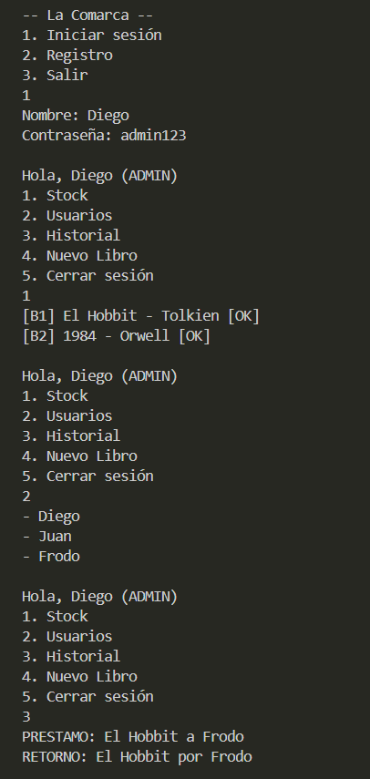
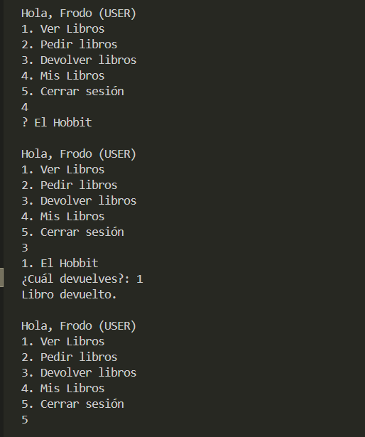
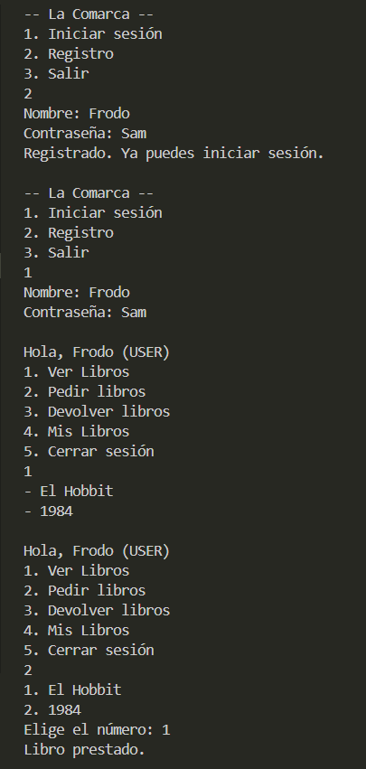

# Proyecto final
## Descripción
Este es un sistema de gestión de una biblioteca, permite varias funciones dependiendo del rol que el usuario tenga, por ejemplo un cliente solo tiene acceso a ver sus libros, pedir libros prestados y devolverlos, mientras que un administrador puede ver a todos los usuarios, añadir libros el historal de los servicios realizados.
## Código
``` java
import java.util.Scanner;
public class Library {
    public static void main(String[] args) {
        Scanner sc = new Scanner(System.in);

        // --- ESTRUCTURAS ---
        Book[] stock = new Book[20];
        User[] directory = new User[10];
        Service[] history = new Service[50];

        int bookCount = 0;
        int userCount = 0; 
        int serviceCount = 0;

        directory[userCount++] = new Admin("Diego", "admin123");
        directory[userCount++] = new Customer("Juan", "123456");

        stock[bookCount++] = new Book("B1", "El Hobbit", "Tolkien");
        stock[bookCount++] = new Book("B2", "1984", "Orwell");

        while (true) {
            User currentUser = null;

            while (currentUser == null) {
                System.out.println("\n-- La Comarca --");
                System.out.println("1. Iniciar sesión");
                System.out.println("2. Registro"); 
                System.out.println( "3. Salir");
                String opt = sc.nextLine();

                if (opt.equals("3")) return;

                System.out.print("Nombre: "); String name = sc.nextLine();
                System.out.print("Contraseña: "); String password = sc.nextLine();

                if (opt.equals("1")) {
                    
                    for (int i = 0; i < userCount; i++) {
                        if (directory[i].name.equalsIgnoreCase(name)) {
                            if (directory[i] instanceof Admin && ((Admin) directory[i]).key.equals(password)) currentUser = directory[i];
                            else if (directory[i] instanceof Customer && ((Customer) directory[i]).password.equals(password)) currentUser = directory[i];
                        }
                    }

                    if (currentUser == null) System.out.println("El nombre o la contraseña estan mal, intenta de nuevo");
                } else {

                    directory[userCount++] = new Customer(name, password);
                    System.out.println("Registrado. Ya puedes iniciar sesión.");
                }
            }

            String menuOpt = "";
            while (!menuOpt.equals("5")) {
                System.out.println("\nHola, " + currentUser.name + (currentUser instanceof Admin ? " (ADMIN)" : " (USER)"));
                System.out.println(currentUser instanceof Admin ? 
                    "1. Stock\n2. Usuarios\n3. Historial\n4. Nuevo Libro\n5. Cerrar sesión" : 
                    "1. Ver Libros\n2. Pedir libros\n3. Devolver libros\n4. Mis Libros\n5. Cerrar sesión");
                menuOpt = sc.nextLine();

                try {
                    if (currentUser instanceof Admin) {
                        switch (menuOpt) {
                            case "1": 

                                for(int i=0; i<bookCount; i++) stock[i].show(); 
                                break;

                            case "2": 

                                for(int i=0; i<userCount; i++) System.out.println("- " + directory[i].name); 
                                break;

                            case "3":

                                for(int i=0; i<serviceCount; i++) history[i].report(); 
                                break;

                            case "4": 

                                System.out.print("Título: "); String title = sc.nextLine();
                                System.out.print("Autor: "); String author = sc.nextLine();
                                stock[bookCount++] = new Book("B"+(bookCount+1), title, author);
                                break;

                        }
                    } else {

                        switch (menuOpt) {
                            case "1":

                                for(int i=0; i<bookCount; i++) if(stock[i].available) System.out.println("- " + stock[i].title);
                                break;

                            case "2":

                                Book[] avail = new Book[20]; int total = 0;
                                for(int i=0; i<bookCount; i++) if(stock[i].available) avail[total++] = stock[i];
                                for(int i=0; i<total; i++) System.out.println((i+1) + ". " + avail[i].title);
                                
                                System.out.print("Elige el número: ");
                                int s = Integer.parseInt(sc.nextLine()) - 1;
                                history[serviceCount] = new Loan("L"+serviceCount, avail[s], currentUser);
                                history[serviceCount++].execute();
                                break;

                            case "3":

                                Book[] loaned = new Book[20]; int loanedTotal = 0;
                                for(int i=0; i<bookCount; i++) if(!stock[i].available) loaned[loanedTotal++] = stock[i];
                                for(int i=0; i<loanedTotal; i++) System.out.println((i+1) + ". " + loaned[i].title);
                                
                                System.out.print("¿Cuál devuelves?: ");
                                int l = Integer.parseInt(sc.nextLine()) - 1;
                                history[serviceCount] = new Return("R"+serviceCount, loaned[l], currentUser);
                                history[serviceCount++].execute();
                                break;

                            case "4":
                                for(int i=0; i<bookCount; i++) if(!stock[i].available) System.out.println("📌 " + stock[i].title);
                                break;

                        }
                    }
                } catch (Exception e) { System.out.println("Error en selección."); }
            }
        }
    }
}

abstract class Item {
    String id;
    String title; 
    boolean available = true;

    Item(String id, String title) { 
        this.id = id;
        this.title = title; 
    }

    abstract void show();
}

class Book extends Item {
    String author;

    Book(String id, String title, String author) { 
        super(id, title);
        this.author = author; 
    }

    void show() { System.out.println("["+id+"] " + title + " - " + author + (available?" [OK]":" [X]")); }
}

abstract class User {
    String name;

    User(String name) { 
        this.name = name; 
    }

}

class Admin extends User {
    String key;

    Admin(String name, String key) { 
        super(name);
        this.key = key; 
    }

}

class Customer extends User {
    String password;

    Customer(String name, String password) { 
        super(name);
        this.password = password; 
    }

}

abstract class Service {
    Item item; 
    User user; 
    String id;

    Service(String id, Item item, User user) { 
        this.id = id;
        this.item = item;
        this.user = user; 
    }

    abstract void execute();
    abstract void report();
}

class Loan extends Service {

    Loan(String id, Item item, User user) { 
        super(id, item, user); 
    }

    void execute() { 
        item.available = false;
        System.out.println("Libro prestado."); 
    }
    
    void report() { 
        System.out.println("PRESTAMO: " + item.title + " a " + user.name); 
    }
}

class Return extends Service {
    Return(String id, Item item, User user) { 
        super(id, item, user); 
    }

    void execute() { 
        item.available = true;
        System.out.println("Libro devuelto."); 
    }

    void report() { 
        System.out.println("RETORNO: " + item.title + " por " + user.name); 
    }
}
```
## Explicación
### Conceptos
* Herencia: 
Se utiliza por ejemplo con Admin y Customer, que heredan de User para usar el atributo name, o Loan y Return que heredan de Service.

* Abstracción:
Se utiliza cuando se definen clases abstractas, que sirven como moldes para que deben hacer las subclases, pero no el como, los ejemplos son las clases Item, User, y Service.

* Poliformismo:
Es la capacidad que tiene un objeto de comportarse de disntintas maneras, por ejemplo un arreglo de tipo Service[], al recorrerlo llamamos a report() y si es un Loan, imprime prestamo, pero si es return, imprime retorno.
### Clases
* Library:
Es la clase principal, aqui se encuentran los arreglos y el inicio de sesión.

* Item:
Es la clase para los objetos de la biblioteca, actualmente solo esta disponible Book, pero se pueden agregar más clases de objetos.

* User:
Gracias a instanceof permite cambiar de menú dependiendo si es admin o customer.

* Service:
Aquí se guarda la información de quien hizo qué y con qué libro.
### Métodos
* Execute: 
Define la lógica de la acción, por ejemplo en un prestamo available() cambia a false, y en una devolución a true.

* Report:
Es lo que se muestra en el historial del administrador.

* Show:
Permite ver los detalles del libro y su estado actual
### Atirbutos
* Available:
Obviamente define el estado del libro, disponible o no, esto para los prestamos y devoluciones.

* Stock, directory, history:
Simulamos una base de datos con tamaños fijos para los diferentes tipos de objetos.

* bookCount, userCount, serviceCount:
Llevan el control de cuantos objetos hay en cada arreglo para prevenir errores.
### Objetos
* Instancias user: 
Se crean durante el registro o ya estan predefinidos en el programa

* Instancias book:
El administrador puede crear nuevos libros, obviamente respetando el límite.

* Instancias service:
Cada vez que se pide o devuelve un libro, esta instancia lo registra.
## Entrada y salida









